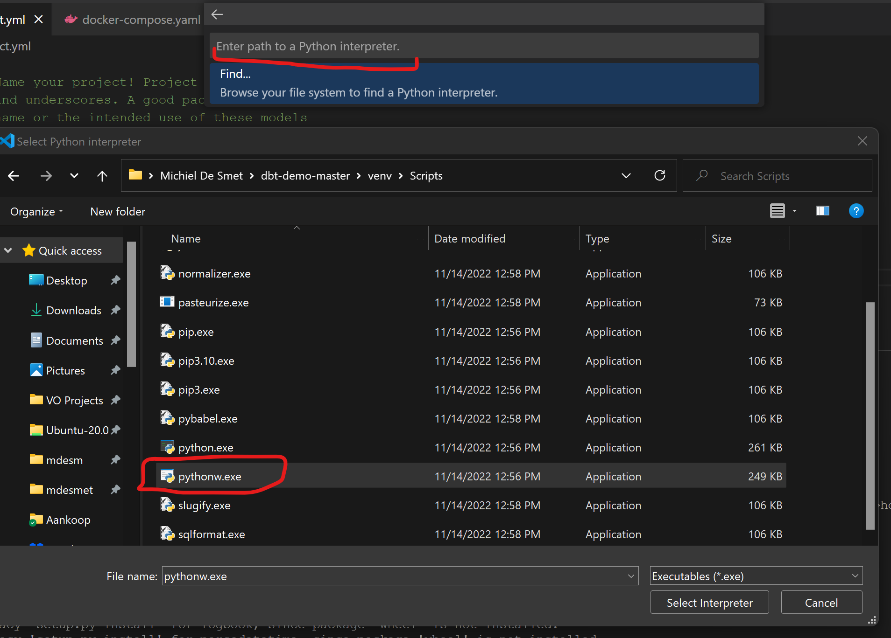
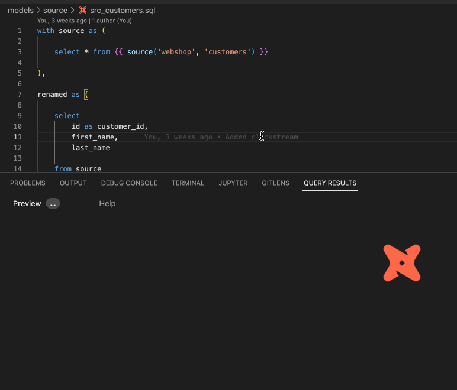
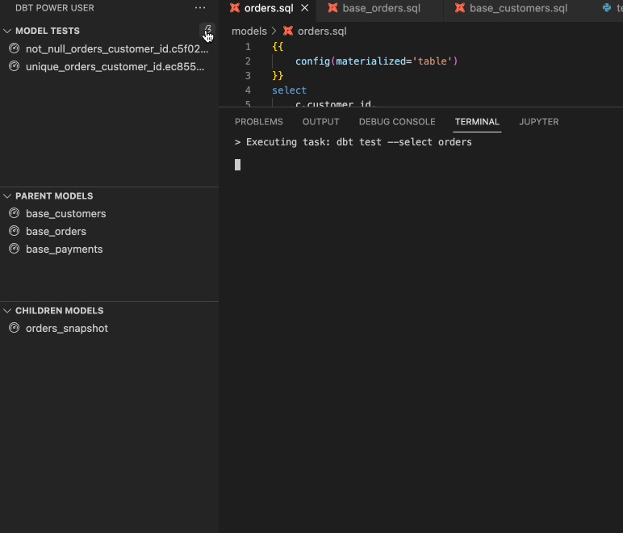
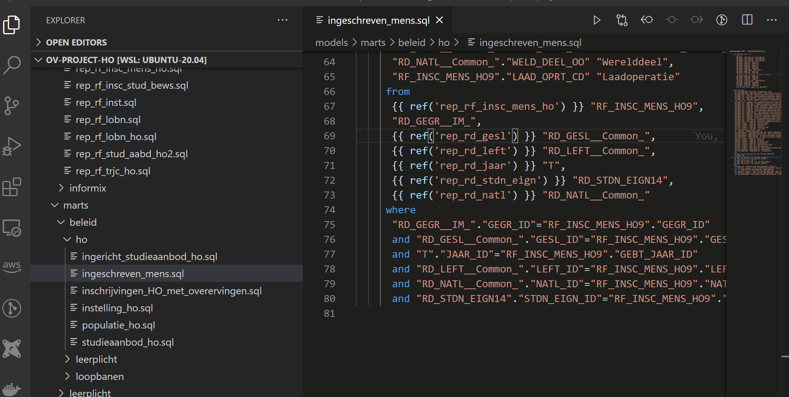

# vscode-dbt-power-user

   

This extension makes vscode seamlessly work with [dbt](https://www.getdbt.com/).

Main features:

- Generate models from your source definitions
- Query result set visualization
- Execute all or individual model tests
- Go to the definition of any models, macro's and sources.
- Autocompletion of models, macros and sources
- Ability to run a model through the play button of the document
- dbt update notifications
- dbt logs viewer (force tailing)

This extension is using the Python extension to detect Python interpreters that are installed in standard locations. See [Python Environments](https://code.visualstudio.com/docs/languages/python#_environments).

This extension is fully compatible with the remote extension. See [Visual Studio Code Remote - Containers](https://code.visualstudio.com/docs/remote/containers) and [Visual Studio Code Remote - WSL](https://code.visualstudio.com/docs/remote/wsl).

Please let us know about any bugs or feature requests through the github issues.

This extension is sponsored by [innover.io](https://innover.io/).

If you want to contribute to the extension, let us know and we will help set you up.

## How to setup the extension

### Associate your .sql files the jinja-sql language

You should associate your .sql files with the jinja-sql language by configuring in Preferences > Settings


or add the following in settings.json:

```
    "files.associations": {
        "*.sql": "jinja-sql"
    },
```

### Select the Python interpreter that has dbt installed

Ensure that the Python interpreter selection is always visible for ease of use:


Make sure that you select the interpreter that has dbt installed. In my case it is virtual environment in the project itself.


Avoid using the setting `dbt.dbtPythonPathOverride` unless using Meltano, the extension depends on the Python interpreter for visual code compatible environment variable parsing.

When you set the Python interpreter, the extension will try to detect dbt and you should be able to make use of the features listed below.

#### Windows specific when using virtual environments

There is a difference between python.exe and pythonw.exe. It is important to select pythonw.exe.



## Features at work

### Generate a model from your source defintion (new)


### Visualize the result set of your model



### See the compiled query of your model


### Execute model tests (new)



### See the model graph



### Go to definition


### Autocompletion


### dbt logs force tailing


