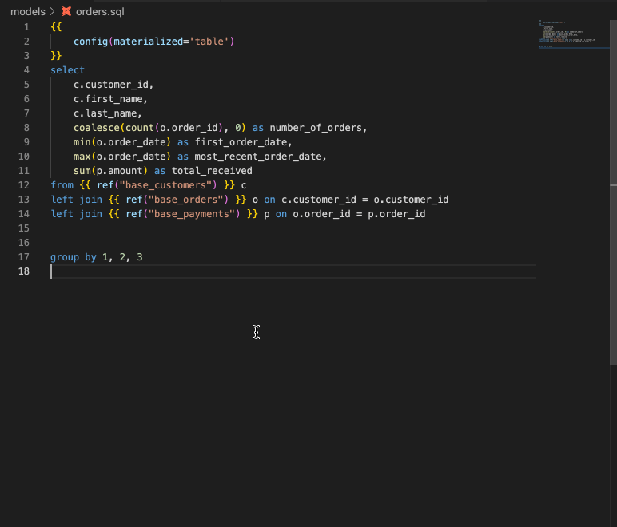
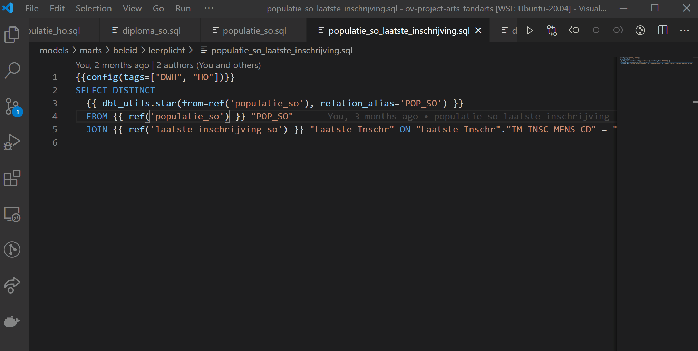

# vscode-dbt-power-user

    

This extension makes vscode seamlessly work with [dbt](https://www.getdbt.com/).

Main features:
- Query result set visualization
- Execute all or individual model tests
- Go to the definition of any models, macro's and sources.
- Autocompletion of models, macros and sources
- Ability to run a model through the play button of the document
- dbt update notifications
- dbt logs viewer (force tailing)

This extension is using the Python extension to detect Python interpreters that are installed in standard locations. See [Python Environments](https://code.visualstudio.com/docs/languages/python#_environments).

This extension is fully compatible with the remote extension. See [Visual Studio Code Remote - Containers](https://code.visualstudio.com/docs/remote/containers) and [Visual Studio Code Remote - WSL](https://code.visualstudio.com/docs/remote/wsl).

Please let us know about any bugs or feature requests through the github issues.

This extension is sponsored by [innover.io](https://innover.io/).

Query visualization and compilation is powered by [dbt-osmosis](https://pypi.org/project/dbt-osmosis/).

## Features at work

### Visualize the result set of your model (new)


### See the compiled query of your model (new)



### Execute model tests (new)


### See the model graph


### Go to definition





### Autocompletion


### dbt logs force tailing


## How to use the extension

You should associate your .sql files with the jinja-sql language by configuring in Preferences > Settings


or add the following in settings.json:

```
    "files.associations": {
        "*.sql": "jinja-sql"
    },
```
